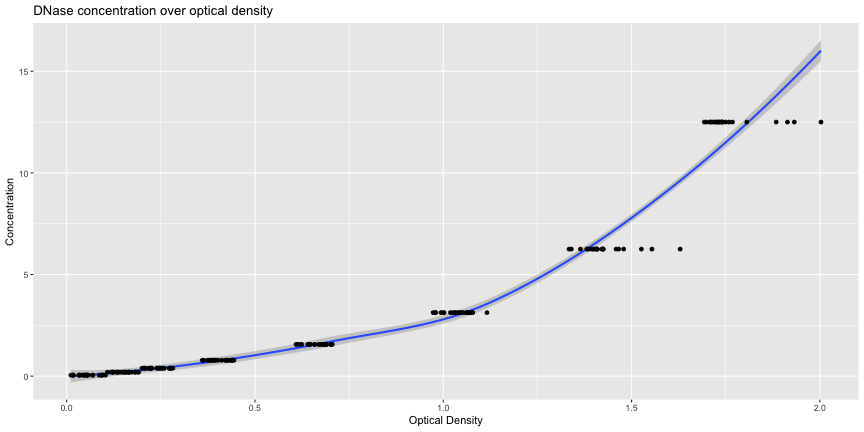
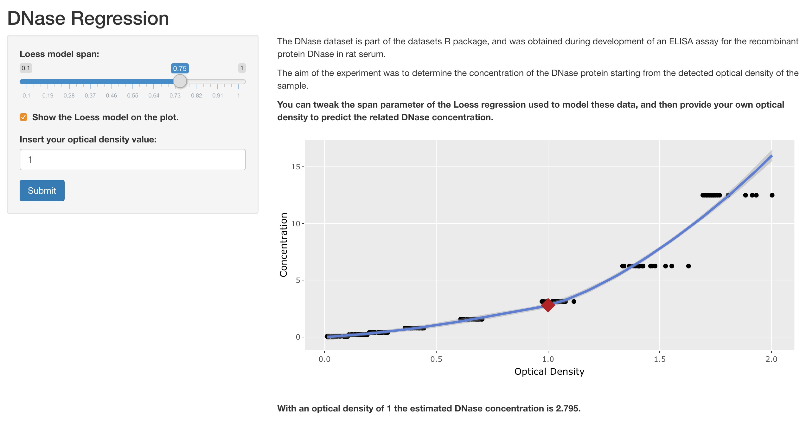

DNase Regression App
========================================================
author: Roberto Preste
date: 2018-10-28 
autosize: true

Overview
========================================================

The DNase dataset is part of the `datasets` R package, and was obtained during development of an ELISA assay for the recombinant protein DNase in rat serum. More information can be found [here](https://stat.ethz.ch/R-manual/R-devel/library/datasets/html/DNase.html).  

The aim of the experiment was to determine the concentration of the DNase protein starting from the detected optical density of the sample.  

The DNase Regression App can be found on [shinyapps.io](https://robertopreste.shinyapps.io/DNaseRegressionApp/).  
Documentation can be found on [GitHub](https://github.com/robertopreste/datasciencecoursera/tree/master/Developing_Data_Products/Course_Project).  


Input data
========================================================

The data used in this project is just composed of 3 columns: the `Run` feature describing which replication of the assay the row refers to, the `conc` values for DNase concentration and the `density` column with optical density values.  


```r
library(datasets)
data("DNase")
head(DNase)
```

```
  Run       conc density
1   1 0.04882812   0.017
2   1 0.04882812   0.018
3   1 0.19531250   0.121
4   1 0.19531250   0.124
5   1 0.39062500   0.206
6   1 0.39062500   0.215
```


Data modeling 
========================================================

The goal is to find the DNase concentration starting from the observed optical density. I used a Loess regression to model this relationship.  




DNase Regression App
========================================================

Users can input an optical density value and get the predicted DNase concentration. They can also tweak the `span` parameter of the Loess regression and see how the prediction changes.  

[](https://robertopreste.shinyapps.io/DNaseRegressionApp/)  


