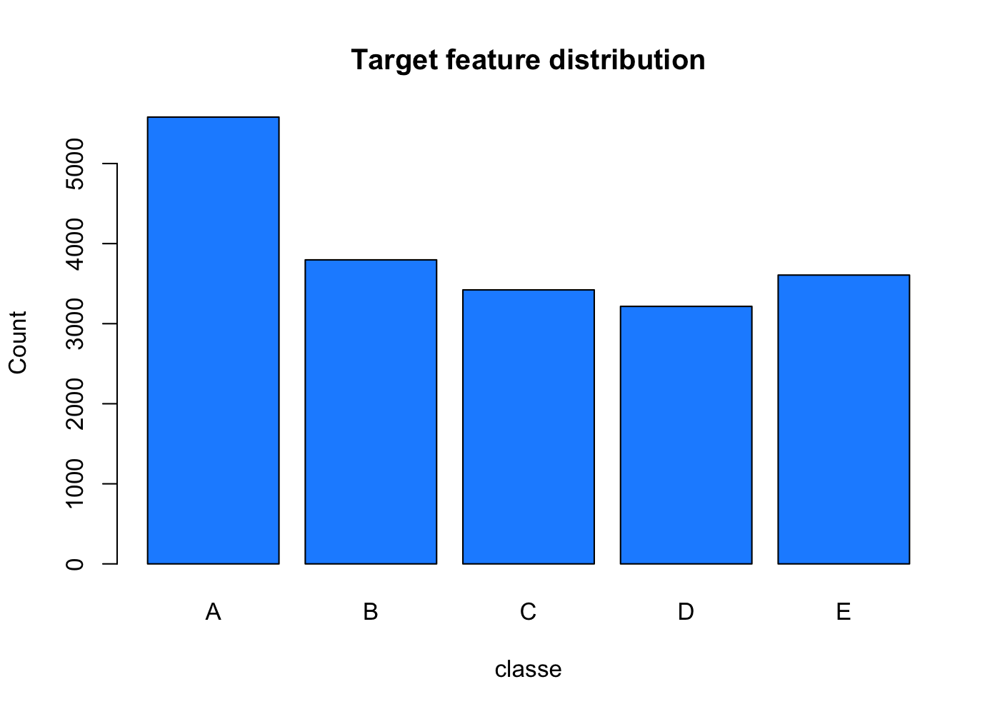
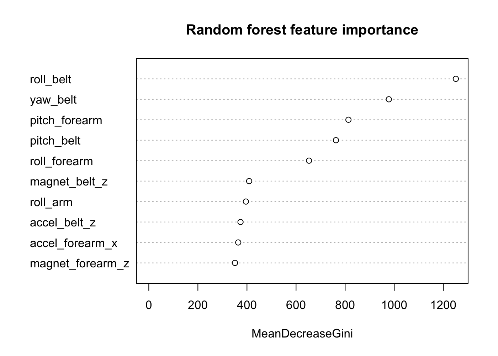

## Overview  

One thing that people regularly do is quantify *how much* of a particular activity they do, but they rarely quantify *how well* they do it. The goal of this project will be to use data from accelerometers on the belt, forearm, arm, and dumbell of 6 participants who were asked to perform barbell lifts correctly and incorrectly in 5 different ways, and predict the manner in which they did the exercise. 
More information can be found [on this web page](http://web.archive.org/web/20161224072740/http:/groupware.les.inf.puc-rio.br/har).  

## Loading data  


```r
library(tidyverse)
library(caret)
```

Let's load the data into R.  


```r
training <- read.csv("pml-training.csv")
dim(training)
```

```
## [1] 19622   160
```


```r
testing <- read.csv("pml-testing.csv")
dim(testing)
```

```
## [1]  20 160
```

Saving the target variable from the `training` dataset and the problem ID from the `testing` dataset.  


```r
target <- training[, "classe"]
prob_ids <- testing[, "problem_id"]
```

Let's see if our classes are balanced.  


```r
plot(target, main = "Target feature distribution", 
     xlab = "classe", ylab = "Count", col = "dodgerblue")
```

<!-- -->


## Data cleaning  

Since the assignment requires us to use data from accelerometers on the belt, forearm, arm and dumbell, let's first select features related to them.  


```r
feats <- grepl("arm|belt|dumbell", names(training))
training <- training[, feats]
dim(training)
```

```
## [1] 19622   114
```


```r
testing <- testing[, feats]
dim(testing)
```

```
## [1]  20 114
```

We have removed 46 columns, now we can drop all features having NA values, based on features in the `testing` dataset.  


```r
nonNA <- colSums(is.na(testing)) == 0
training <- training[, nonNA]
dim(training)
```

```
## [1] 19622    39
```


```r
testing <- testing[, nonNA]
dim(testing)
```

```
## [1] 20 39
```

We kept 39 of the starting 160 features. This might not be the proper approach in some cases, but it should be alright for this project. As a final check, let's look for uninformative features, namely those having zero or near-zero variance.  


```r
nearZeroVar(training, saveMetrics = T)
```

```
##                     freqRatio percentUnique zeroVar   nzv
## roll_belt            1.101904     6.7781062   FALSE FALSE
## pitch_belt           1.036082     9.3772296   FALSE FALSE
## yaw_belt             1.058480     9.9734991   FALSE FALSE
## total_accel_belt     1.063160     0.1477933   FALSE FALSE
## gyros_belt_x         1.058651     0.7134849   FALSE FALSE
## gyros_belt_y         1.144000     0.3516461   FALSE FALSE
## gyros_belt_z         1.066214     0.8612782   FALSE FALSE
## accel_belt_x         1.055412     0.8357966   FALSE FALSE
## accel_belt_y         1.113725     0.7287738   FALSE FALSE
## accel_belt_z         1.078767     1.5237998   FALSE FALSE
## magnet_belt_x        1.090141     1.6664968   FALSE FALSE
## magnet_belt_y        1.099688     1.5187035   FALSE FALSE
## magnet_belt_z        1.006369     2.3290184   FALSE FALSE
## roll_arm            52.338462    13.5256345   FALSE FALSE
## pitch_arm           87.256410    15.7323412   FALSE FALSE
## yaw_arm             33.029126    14.6570176   FALSE FALSE
## total_accel_arm      1.024526     0.3363572   FALSE FALSE
## gyros_arm_x          1.015504     3.2769341   FALSE FALSE
## gyros_arm_y          1.454369     1.9162165   FALSE FALSE
## gyros_arm_z          1.110687     1.2638875   FALSE FALSE
## accel_arm_x          1.017341     3.9598410   FALSE FALSE
## accel_arm_y          1.140187     2.7367241   FALSE FALSE
## accel_arm_z          1.128000     4.0362858   FALSE FALSE
## magnet_arm_x         1.000000     6.8239731   FALSE FALSE
## magnet_arm_y         1.056818     4.4439914   FALSE FALSE
## magnet_arm_z         1.036364     6.4468454   FALSE FALSE
## roll_forearm        11.589286    11.0895933   FALSE FALSE
## pitch_forearm       65.983051    14.8557741   FALSE FALSE
## yaw_forearm         15.322835    10.1467740   FALSE FALSE
## total_accel_forearm  1.128928     0.3567424   FALSE FALSE
## gyros_forearm_x      1.059273     1.5187035   FALSE FALSE
## gyros_forearm_y      1.036554     3.7763735   FALSE FALSE
## gyros_forearm_z      1.122917     1.5645704   FALSE FALSE
## accel_forearm_x      1.126437     4.0464784   FALSE FALSE
## accel_forearm_y      1.059406     5.1116094   FALSE FALSE
## accel_forearm_z      1.006250     2.9558659   FALSE FALSE
## magnet_forearm_x     1.012346     7.7667924   FALSE FALSE
## magnet_forearm_y     1.246914     9.5403119   FALSE FALSE
## magnet_forearm_z     1.000000     8.5771073   FALSE FALSE
```

It seems like all the selected features can be informative, so we can use them to build our models.  


## Modeling  

First of all, we need to create a training and testing subset from the `training` dataset, using respectively 70% and 30% of the starting data.  


```r
set.seed(420)
training$classe <- target
tridx <- createDataPartition(target, p = 0.8, list = F)
df_train <- training[tridx, ]
df_test <- training[-tridx, ]
```

Now we'll compare a couple of models. We can (hopefully) expect an error rate less than 1%.  
Let's start using a simple classification tree model.  


```r
library(rpart)
set.seed(420)
fit_tree <- train(classe ~ ., data = df_train, method = "rpart")
fit_tree
```

```
## CART 
## 
## 15699 samples
##    39 predictor
##     5 classes: 'A', 'B', 'C', 'D', 'E' 
## 
## No pre-processing
## Resampling: Bootstrapped (25 reps) 
## Summary of sample sizes: 15699, 15699, 15699, 15699, 15699, 15699, ... 
## Resampling results across tuning parameters:
## 
##   cp          Accuracy   Kappa     
##   0.02127281  0.5779991  0.46862361
##   0.03950452  0.4157213  0.21746739
##   0.11731197  0.3250498  0.06460988
## 
## Accuracy was used to select the optimal model using the largest value.
## The final value used for the model was cp = 0.02127281.
```

Let's see how well it works on our `df_test` data.  


```r
pred_tree <- predict(fit_tree, df_test)
confusionMatrix(pred_tree, df_test$classe)
```

```
## Confusion Matrix and Statistics
## 
##           Reference
## Prediction   A   B   C   D   E
##          A 829 197 145  86  69
##          B   2 128  12   4   5
##          C  71 246 296  69 132
##          D 193 184 231 427  75
##          E  21   4   0  57 440
## 
## Overall Statistics
##                                           
##                Accuracy : 0.5404          
##                  95% CI : (0.5247, 0.5561)
##     No Information Rate : 0.2845          
##     P-Value [Acc > NIR] : < 2.2e-16       
##                                           
##                   Kappa : 0.4178          
##  Mcnemar's Test P-Value : < 2.2e-16       
## 
## Statistics by Class:
## 
##                      Class: A Class: B Class: C Class: D Class: E
## Sensitivity            0.7428  0.16864  0.43275   0.6641   0.6103
## Specificity            0.8229  0.99273  0.84007   0.7918   0.9744
## Pos Pred Value         0.6252  0.84768  0.36364   0.3847   0.8429
## Neg Pred Value         0.8895  0.83271  0.87520   0.9232   0.9174
## Prevalence             0.2845  0.19347  0.17436   0.1639   0.1838
## Detection Rate         0.2113  0.03263  0.07545   0.1088   0.1122
## Detection Prevalence   0.3380  0.03849  0.20749   0.2829   0.1331
## Balanced Accuracy      0.7829  0.58069  0.63641   0.7279   0.7923
```

An accuracy of 0.54 is not very promising. We can try with a random forest model instead.  


```r
library(randomForest)
set.seed(420)
fit_rf <- randomForest(classe ~ ., data = df_train)
fit_rf
```

```
## 
## Call:
##  randomForest(formula = classe ~ ., data = df_train) 
##                Type of random forest: classification
##                      Number of trees: 500
## No. of variables tried at each split: 6
## 
##         OOB estimate of  error rate: 0.61%
## Confusion matrix:
##      A    B    C    D    E class.error
## A 4455    6    3    0    0 0.002016129
## B   10 3021    7    0    0 0.005595787
## C    1   19 2705   12    1 0.012052593
## D    1    0   22 2545    5 0.010882239
## E    0    0    0    8 2878 0.002772003
```

The randomForest already takes care of cross validation, and we can see an error rate of 0.61%.

Let's check its performance on the `df_test` subset.  


```r
pred_rf <- predict(fit_rf, df_test)
confusionMatrix(pred_rf, df_test$classe)
```

```
## Confusion Matrix and Statistics
## 
##           Reference
## Prediction    A    B    C    D    E
##          A 1116    0    0    0    0
##          B    0  757    5    0    0
##          C    0    2  672    6    0
##          D    0    0    7  636    0
##          E    0    0    0    1  721
## 
## Overall Statistics
##                                           
##                Accuracy : 0.9946          
##                  95% CI : (0.9918, 0.9967)
##     No Information Rate : 0.2845          
##     P-Value [Acc > NIR] : < 2.2e-16       
##                                           
##                   Kappa : 0.9932          
##  Mcnemar's Test P-Value : NA              
## 
## Statistics by Class:
## 
##                      Class: A Class: B Class: C Class: D Class: E
## Sensitivity            1.0000   0.9974   0.9825   0.9891   1.0000
## Specificity            1.0000   0.9984   0.9975   0.9979   0.9997
## Pos Pred Value         1.0000   0.9934   0.9882   0.9891   0.9986
## Neg Pred Value         1.0000   0.9994   0.9963   0.9979   1.0000
## Prevalence             0.2845   0.1935   0.1744   0.1639   0.1838
## Detection Rate         0.2845   0.1930   0.1713   0.1621   0.1838
## Detection Prevalence   0.2845   0.1942   0.1733   0.1639   0.1840
## Balanced Accuracy      1.0000   0.9979   0.9900   0.9935   0.9998
```

With an accuracy of 0.9946, we can expect an out-of-sample error of 0.54%. We can safely conclude that this will be our model of choice for the rest of the project.   

We might be curious about the most important features chosen by our model. Let's see the top 10.  


```r
varImpPlot(fit_rf, n.var = 10, main = "Random forest feature importance")
```

<!-- -->

## Final prediction  

Let's first retrain our random forest model on the whole `training` dataset, so we can use it for the actual prediction.  


```r
set.seed(420)
fit <- randomForest(classe ~ ., data = training)
```

Now we can use the trained model to predict the `testing` data.  


```r
pred <- predict(fit, testing)
# Actual answer not shown ;)
# pred
```

